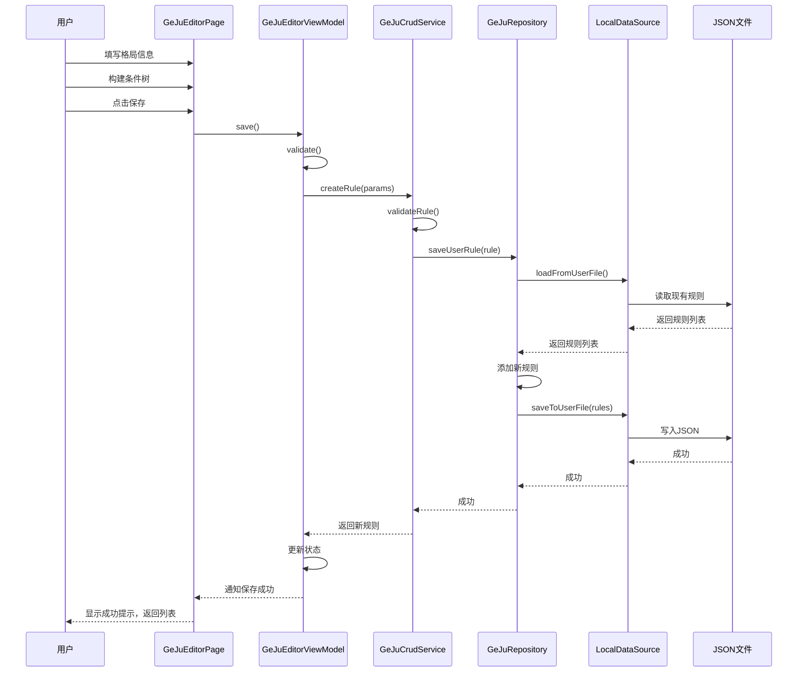

# 格局管理程序设计方案

## 一、需求概述

### 1.1 功能目标
设计一个完整的格局管理程序，支持：
- **Create（创建）**：新建自定义格局规则
- **Read（读取）**：加载、浏览、搜索格局规则
- **Update（更新）**：编辑现有格局规则
- **Delete（删除）**：删除自定义格局规则

### 1.2 核心约束
- 内置格局（从assets加载）为**只读**，不可编辑删除
- 用户自定义格局存储在本地文件系统，支持完整CRUD
- 格局条件支持可视化编辑（非纯JSON编辑）
- 遵循项目现有的 **Clean Architecture** 分层架构

---

## 二、系统架构设计

### 2.1 分层结构

```
┌─────────────────────────────────────────────────────────────┐
│                    Presentation Layer                        │
├─────────────────────────────────────────────────────────────┤
│  GeJuListPage    │  GeJuDetailPage   │  GeJuEditorPage       │
│  格局列表页面    │  格局详情页面     │  格局编辑器页面       │
├─────────────────────────────────────────────────────────────┤
│  GeJuListViewModel              │  GeJuEditorViewModel       │
│  列表状态管理、筛选、排序       │  编辑状态、表单验证        │
└─────────────────────────────────────────────────────────────┘
                              │
                              ▼
┌─────────────────────────────────────────────────────────────┐
│                      Domain Layer                            │
├─────────────────────────────────────────────────────────────┤
│  GeJuCrudService                                             │
│  - createRule()  - readRule()  - updateRule()  - deleteRule()│
│  - validateRule() - searchRules() - filterByCategory()       │
├─────────────────────────────────────────────────────────────┤
│  IGeJuRepository (Interface)                                 │
│  - loadBuiltInRules()    - loadUserRules()                   │
│  - saveUserRule()        - deleteUserRule()                  │
│  - exportRules()         - importRules()                     │
└─────────────────────────────────────────────────────────────┘
                              │
                              ▼
┌─────────────────────────────────────────────────────────────┐
│                       Data Layer                             │
├─────────────────────────────────────────────────────────────┤
│  GeJuRepositoryImpl                                          │
│  - AssetRuleLoader (内置规则加载)                            │
│  - FileRuleStorage (用户规则存储)                            │
├─────────────────────────────────────────────────────────────┤
│  GeJuLocalDataSource                                         │
│  - JSON文件读写                                              │
│  - 文件路径管理                                              │
└─────────────────────────────────────────────────────────────┘
```

### 2.2 数据存储策略

| 类型 | 存储位置 | 读写权限 | 说明 |
|------|----------|----------|------|
| 内置格局 | `assets/qizhengsiyu/ge_ju/*.json` | 只读 | 随应用发布，不可修改 |
| 用户格局 | `应用文档目录/ge_ju/user_rules.json` | 读写 | 用户自定义，完整CRUD |
| 导入格局 | `应用文档目录/ge_ju/imported/*.json` | 读写 | 从外部导入的规则 |

---

## 三、核心模块设计

### 3.1 Repository 层

#### 3.1.1 接口定义
```dart
/// lib/domain/repositories/ge_ju_repository.dart
abstract class IGeJuRepository {
  /// 加载所有内置格局（只读）
  Future<List<GeJuRule>> loadBuiltInRules();

  /// 加载所有用户自定义格局
  Future<List<GeJuRule>> loadUserRules();

  /// 加载全部格局（内置+用户）
  Future<List<GeJuRule>> loadAllRules();

  /// 保存用户格局（新增或更新）
  Future<void> saveUserRule(GeJuRule rule);

  /// 批量保存用户格局
  Future<void> saveUserRules(List<GeJuRule> rules);

  /// 删除用户格局
  Future<void> deleteUserRule(String ruleId);

  /// 导出格局为JSON
  Future<String> exportRules(List<GeJuRule> rules);

  /// 从JSON导入格局
  Future<List<GeJuRule>> importRules(String jsonContent);

  /// 判断规则是否为内置（不可编辑）
  bool isBuiltInRule(String ruleId);
}
```

#### 3.1.2 实现类
```dart
/// lib/data/repositories/ge_ju_repository_impl.dart
class GeJuRepositoryImpl implements IGeJuRepository {
  final GeJuLocalDataSource _localDataSource;

  // 内置规则ID前缀，用于区分
  static const String _builtInPrefix = 'builtin_';

  // 缓存
  List<GeJuRule>? _builtInRulesCache;
  List<GeJuRule>? _userRulesCache;

  // ...实现
}
```

### 3.2 LocalDataSource 层

```dart
/// lib/data/datasources/local/ge_ju_local_data_source.dart
abstract class GeJuLocalDataSource {
  /// 从assets加载内置规则
  Future<List<GeJuRule>> loadFromAssets(List<String> assetPaths);

  /// 从用户文件加载规则
  Future<List<GeJuRule>> loadFromUserFile();

  /// 保存规则到用户文件
  Future<void> saveToUserFile(List<GeJuRule> rules);

  /// 获取用户规则文件路径
  Future<String> getUserRulesFilePath();
}

class GeJuLocalDataSourceImpl implements GeJuLocalDataSource {
  // 使用 path_provider 获取应用文档目录
  // 使用 rootBundle 读取 assets
}
```

### 3.3 Service 层

```dart
/// lib/domain/services/ge_ju_crud_service.dart
class GeJuCrudService {
  final IGeJuRepository _repository;

  GeJuCrudService({required IGeJuRepository repository})
      : _repository = repository;

  // ========== CRUD 操作 ==========

  /// 创建新格局
  Future<GeJuRule> createRule(GeJuRuleCreateParams params);

  /// 获取单个格局详情
  Future<GeJuRule?> getRule(String ruleId);

  /// 获取所有格局
  Future<List<GeJuRule>> getAllRules();

  /// 更新格局
  Future<void> updateRule(GeJuRule rule);

  /// 删除格局
  Future<void> deleteRule(String ruleId);

  // ========== 查询与筛选 ==========

  /// 按关键词搜索
  Future<List<GeJuRule>> searchRules(String keyword);

  /// 按分类筛选
  Future<List<GeJuRule>> filterByCategory(String category);

  /// 按吉凶筛选
  Future<List<GeJuRule>> filterByJiXiong(JiXiongEnum jiXiong);

  /// 按格局类型筛选
  Future<List<GeJuRule>> filterByType(GeJuType type);

  // ========== 验证 ==========

  /// 验证格局规则的有效性
  ValidationResult validateRule(GeJuRule rule);

  /// 验证条件的有效性
  ValidationResult validateCondition(GeJuCondition condition);

  // ========== 导入导出 ==========

  /// 导出选中的格局
  Future<String> exportRules(List<String> ruleIds);

  /// 从JSON导入格局
  Future<ImportResult> importRulesFromJson(String jsonContent);

  /// 复制格局（用于基于现有格局创建新格局）
  Future<GeJuRule> duplicateRule(String ruleId);
}

/// 创建格局的参数
class GeJuRuleCreateParams {
  final String name;
  final String className;
  final String? books;
  final String description;
  final String? source;
  final JiXiongEnum jiXiong;
  final GeJuType geJuType;
  final GeJuScope scope;
  final GeJuCondition? conditions;
}

/// 验证结果
class ValidationResult {
  final bool isValid;
  final List<String> errors;
  final List<String> warnings;
}

/// 导入结果
class ImportResult {
  final int successCount;
  final int failedCount;
  final List<GeJuRule> importedRules;
  final List<String> errors;
}
```

### 3.4 ViewModel 层

#### 3.4.1 列表 ViewModel
```dart
/// lib/presentation/viewmodels/ge_ju_list_viewmodel.dart
class GeJuListViewModel extends ChangeNotifier {
  final GeJuCrudService _crudService;

  // 状态
  List<GeJuRule> _allRules = [];
  List<GeJuRule> _filteredRules = [];
  bool _isLoading = false;
  String? _errorMessage;

  // 筛选条件
  String _searchKeyword = '';
  String? _selectedCategory;
  JiXiongEnum? _selectedJiXiong;
  GeJuType? _selectedType;
  GeJuScope? _selectedScope;
  bool _showBuiltInOnly = false;
  bool _showUserOnly = false;

  // 排序
  GeJuSortField _sortField = GeJuSortField.name;
  bool _sortAscending = true;

  // Getters
  List<GeJuRule> get rules => _filteredRules;
  bool get isLoading => _isLoading;
  String? get errorMessage => _errorMessage;

  // 方法
  Future<void> loadRules();
  void search(String keyword);
  void filterByCategory(String? category);
  void filterByJiXiong(JiXiongEnum? jiXiong);
  void filterByType(GeJuType? type);
  void filterByScope(GeJuScope? scope);
  void toggleBuiltInOnly();
  void toggleUserOnly();
  void sortBy(GeJuSortField field, {bool? ascending});
  void clearFilters();
  Future<void> deleteRule(String ruleId);
  Future<void> refreshRules();
}

enum GeJuSortField {
  name,
  className,
  jiXiong,
  geJuType,
  createdAt,
}
```

#### 3.4.2 编辑器 ViewModel
```dart
/// lib/presentation/viewmodels/ge_ju_editor_viewmodel.dart
class GeJuEditorViewModel extends ChangeNotifier {
  final GeJuCrudService _crudService;

  // 编辑模式
  bool _isCreateMode = true;
  String? _editingRuleId;

  // 表单状态
  String _name = '';
  String _className = '自定义';
  String _books = '';
  String _description = '';
  String _source = '';
  JiXiongEnum _jiXiong = JiXiongEnum.PING;
  GeJuType _geJuType = GeJuType.pin;
  GeJuScope _scope = GeJuScope.natal;
  GeJuCondition? _condition;

  // 验证状态
  ValidationResult? _validationResult;
  bool _hasUnsavedChanges = false;

  // 方法
  void initForCreate();
  Future<void> initForEdit(String ruleId);
  void updateName(String value);
  void updateClassName(String value);
  void updateDescription(String value);
  void updateJiXiong(JiXiongEnum value);
  void updateGeJuType(GeJuType value);
  void updateScope(GeJuScope value);
  void updateCondition(GeJuCondition? condition);

  ValidationResult validate();
  Future<bool> save();
  void reset();
  bool get canSave => validate().isValid;
}
```

### 3.5 条件编辑器设计

条件编辑是最复杂的部分，需要提供可视化界面让用户构建条件树。

#### 3.5.1 条件编辑器模型
```dart
/// lib/presentation/models/condition_editor_model.dart

/// 条件节点类型
enum ConditionNodeType {
  logic,      // 逻辑节点 (AND/OR/NOT)
  leaf,       // 叶子节点 (具体条件)
}

/// 条件编辑器节点
class ConditionEditorNode {
  final String id;
  final ConditionNodeType nodeType;
  final String conditionType;  // 'and', 'or', 'sameGong', 'starInGong' 等
  final Map<String, dynamic> params;
  final List<ConditionEditorNode> children;

  // 转换为 GeJuCondition
  GeJuCondition toCondition();

  // 从 GeJuCondition 创建
  static ConditionEditorNode fromCondition(GeJuCondition condition);
}
```

#### 3.5.2 条件类型注册表
```dart
/// lib/presentation/models/condition_type_registry.dart

/// 条件类型定义
class ConditionTypeDefinition {
  final String type;
  final String displayName;
  final String category;
  final List<ConditionParamDefinition> params;
  final String? description;
}

/// 条件参数定义
class ConditionParamDefinition {
  final String name;
  final String displayName;
  final ConditionParamType paramType;
  final bool required;
  final dynamic defaultValue;
  final List<dynamic>? options;  // 用于枚举类型参数
}

enum ConditionParamType {
  star,           // 星曜选择
  starList,       // 多星曜选择
  gong,           // 宫位选择
  gongList,       // 多宫位选择
  constellation,  // 星宿选择
  constellationList,
  walkingState,   // 运行状态
  walkingStateList,
  fourType,       // 恩难仇用
  fourTypeList,
  huaYao,         // 化曜
  huaYaoList,
  shenSha,        // 神煞
  shenShaList,
  season,         // 季节
  seasonList,
  moonPhase,      // 月相
  moonPhaseList,
  boolean,        // 布尔值
  string,         // 字符串
  role,           // 四主角色
  roleList,
  destinyGong,    // 命理宫位
  gongStatus,     // 宫位状态
  gongStatusList,
}

/// 条件类型注册表
class ConditionTypeRegistry {
  static final List<ConditionTypeDefinition> allTypes = [
    // 星曜位置类
    ConditionTypeDefinition(
      type: 'starInGong',
      displayName: '星在宫',
      category: '星曜位置',
      params: [
        ConditionParamDefinition(name: 'star', displayName: '星曜', paramType: ConditionParamType.star, required: true),
        ConditionParamDefinition(name: 'gongs', displayName: '宫位', paramType: ConditionParamType.gongList, required: true),
      ],
    ),
    // ... 其他条件类型
  ];

  static ConditionTypeDefinition? getByType(String type);
  static List<ConditionTypeDefinition> getByCategory(String category);
  static List<String> get categories;
}
```

---

## 四、UI 设计

### 4.1 页面结构

```
┌─────────────────────────────────────────────────────────────┐
│                     GeJuListPage                             │
│  ┌─────────────────────────────────────────────────────────┐│
│  │ 搜索栏 [________________] [筛选] [排序] [新建]          ││
│  └─────────────────────────────────────────────────────────┘│
│  ┌─────────────────────────────────────────────────────────┐│
│  │ 筛选条件: [分类▼] [吉凶▼] [类型▼] [范围▼] [清除]       ││
│  └─────────────────────────────────────────────────────────┘│
│  ┌─────────────────────────────────────────────────────────┐│
│  │ 格局列表                                                 ││
│  │ ┌─────────────────────────────────────────────────────┐ ││
│  │ │ 📌 日边红杏          [木星格局] [吉] [贵]    [···]  │ ││
│  │ │ 木星与太阳同宫，主贵显。                            │ ││
│  │ └─────────────────────────────────────────────────────┘ ││
│  │ ┌─────────────────────────────────────────────────────┐ ││
│  │ │ 📝 自定义格局1       [自定义]   [吉] [富]    [···]  │ ││
│  │ │ ...                                                  │ ││
│  │ └─────────────────────────────────────────────────────┘ ││
│  └─────────────────────────────────────────────────────────┘│
│  统计: 共 445 条 | 内置 400 | 自定义 45                      │
└─────────────────────────────────────────────────────────────┘

┌─────────────────────────────────────────────────────────────┐
│                    GeJuDetailPage                            │
│  ┌─────────────────────────────────────────────────────────┐│
│  │ [返回]        日边红杏            [编辑] [复制] [删除]  ││
│  └─────────────────────────────────────────────────────────┘│
│  ┌─────────────────────────────────────────────────────────┐│
│  │ 基本信息                                                 ││
│  │ ├─ 分类: 木星格局                                        ││
│  │ ├─ 出处: 《果老星宗·星格贵贱总赋》                        ││
│  │ ├─ 吉凶: 吉                                              ││
│  │ ├─ 类型: 贵                                              ││
│  │ └─ 范围: 命盘                                            ││
│  └─────────────────────────────────────────────────────────┘│
│  ┌─────────────────────────────────────────────────────────┐│
│  │ 描述                                                     ││
│  │ 日邊紅杏，早占鰲頭。[紅杏者木星也，木為官、恩、命、     ││
│  │ 令等用者，與太陽同行。]                                  ││
│  └─────────────────────────────────────────────────────────┘│
│  ┌─────────────────────────────────────────────────────────┐│
│  │ 判断条件                                                 ││
│  │ ├─ AND                                                   ││
│  │ │   ├─ 木日同宫                                          ││
│  │ │   └─ OR                                                ││
│  │ │       ├─ 木星为命主                                    ││
│  │ │       └─ 木星为恩星                                    ││
│  └─────────────────────────────────────────────────────────┘│
│  ┌─────────────────────────────────────────────────────────┐│
│  │ JSON 源码                              [复制] [展开]     ││
│  │ { "type": "and", "conditions": [...] }                   ││
│  └─────────────────────────────────────────────────────────┘│
└─────────────────────────────────────────────────────────────┘

┌─────────────────────────────────────────────────────────────┐
│                    GeJuEditorPage                            │
│  ┌─────────────────────────────────────────────────────────┐│
│  │ [取消]       新建格局 / 编辑格局              [保存]    ││
│  └─────────────────────────────────────────────────────────┘│
│  ┌─────────────────────────────────────────────────────────┐│
│  │ 基本信息                                                 ││
│  │ 名称*   [________________________]                       ││
│  │ 分类    [自定义           ▼]                             ││
│  │ 出处    [________________________]                       ││
│  │ 吉凶*   (○吉) (○凶) (●平)                               ││
│  │ 类型*   [贫▼]                                            ││
│  │ 范围*   (●命盘) (○行限) (○通用)                          ││
│  │ 描述    [________________________]                       ││
│  │         [________________________]                       ││
│  └─────────────────────────────────────────────────────────┘│
│  ┌─────────────────────────────────────────────────────────┐│
│  │ 判断条件                               [添加条件]        ││
│  │ ┌─────────────────────────────────────────────────────┐ ││
│  │ │ ● AND 逻辑组                              [×] [+]   │ ││
│  │ │   ├─ ○ 星曜同宫: 木星, 太阳              [×] [编辑] │ ││
│  │ │   └─ ● OR 逻辑组                          [×] [+]   │ ││
│  │ │       ├─ ○ 星为四主: 木星, 命主          [×] [编辑] │ ││
│  │ │       └─ ○ 恩难仇用: 木星为恩            [×] [编辑] │ ││
│  │ └─────────────────────────────────────────────────────┘ ││
│  └─────────────────────────────────────────────────────────┘│
│  ┌─────────────────────────────────────────────────────────┐│
│  │ ⚠ 验证警告: 建议添加更多条件以提高匹配精确度            ││
│  └─────────────────────────────────────────────────────────┘│
└─────────────────────────────────────────────────────────────┘
```

### 4.2 条件编辑器弹窗

```
┌─────────────────────────────────────────────────────────────┐
│                    添加/编辑条件                             │
│  ┌─────────────────────────────────────────────────────────┐│
│  │ 条件类型                                                 ││
│  │ [星曜位置▼]  -->  [星曜在宫位▼]                          ││
│  └─────────────────────────────────────────────────────────┘│
│  ┌─────────────────────────────────────────────────────────┐│
│  │ 条件参数                                                 ││
│  │ 星曜*   [木星           ▼]                               ││
│  │ 宫位*   [☑子] [☑丑] [☐寅] [☐卯] [☐辰] [☐巳]             ││
│  │         [☐午] [☐未] [☐申] [☐酉] [☐戌] [☐亥]             ││
│  └─────────────────────────────────────────────────────────┘│
│  ┌─────────────────────────────────────────────────────────┐│
│  │ 预览: 木星入子/丑宫                                      ││
│  └─────────────────────────────────────────────────────────┘│
│                              [取消]            [确定]        │
└─────────────────────────────────────────────────────────────┘
```

---

## 五、路由设计

```dart
/// 路由路径定义
class GeJuRoutes {
  static const String list = '/ge_ju/list';
  static const String detail = '/ge_ju/detail/:id';
  static const String create = '/ge_ju/create';
  static const String edit = '/ge_ju/edit/:id';
}

/// 路由注册（在 navigator.dart 或 routes.dart 中）
Map<String, WidgetBuilder> geJuRoutes = {
  GeJuRoutes.list: (context) => const GeJuListPage(),
  // detail, create, edit 需要带参数路由
};
```

---

## 六、依赖注入配置

```dart
/// 在 di.dart 中添加
List<SingleChildWidget> createGeJuProviders() {
  return [
    // DataSource
    Provider<GeJuLocalDataSource>(
      create: (_) => GeJuLocalDataSourceImpl(),
    ),

    // Repository
    Provider<IGeJuRepository>(
      create: (context) => GeJuRepositoryImpl(
        localDataSource: context.read<GeJuLocalDataSource>(),
      ),
    ),

    // Service
    Provider<GeJuCrudService>(
      create: (context) => GeJuCrudService(
        repository: context.read<IGeJuRepository>(),
      ),
    ),

    // ViewModels
    ChangeNotifierProvider<GeJuListViewModel>(
      create: (context) => GeJuListViewModel(
        crudService: context.read<GeJuCrudService>(),
      ),
    ),

    ChangeNotifierProvider<GeJuEditorViewModel>(
      create: (context) => GeJuEditorViewModel(
        crudService: context.read<GeJuCrudService>(),
      ),
    ),
  ];
}
```

---

## 七、数据流示例

### 7.1 创建新格局流程



---

## 八、错误处理策略

### 8.1 错误类型定义
```dart
/// lib/domain/errors/ge_ju_errors.dart

abstract class GeJuError implements Exception {
  final String message;
  GeJuError(this.message);
}

class RuleNotFoundError extends GeJuError {
  final String ruleId;
  RuleNotFoundError(this.ruleId) : super('格局不存在: $ruleId');
}

class RuleValidationError extends GeJuError {
  final List<String> errors;
  RuleValidationError(this.errors) : super('格局验证失败: ${errors.join(", ")}');
}

class BuiltInRuleModificationError extends GeJuError {
  BuiltInRuleModificationError() : super('内置格局不可修改');
}

class RuleStorageError extends GeJuError {
  RuleStorageError(String message) : super('存储错误: $message');
}

class RuleImportError extends GeJuError {
  final int lineNumber;
  RuleImportError(this.lineNumber, String message)
      : super('导入错误 (行 $lineNumber): $message');
}
```

---

## 九、测试策略

### 9.1 单元测试
- GeJuCrudService 的所有 CRUD 方法
- 验证逻辑测试
- 条件序列化/反序列化测试

### 9.2 集成测试
- Repository 与 DataSource 的集成
- 文件读写的完整流程

### 9.3 Widget 测试
- 列表页面的筛选、排序功能
- 编辑器的表单验证
- 条件编辑器的交互

---

## 十、后续扩展

### 10.1 云同步支持
- 可扩展 Repository 接口以支持远程数据源
- 添加冲突解决策略

### 10.2 版本管理
- 格局规则版本控制
- 历史记录查看与回滚

### 10.3 社区分享
- 导出为分享格式
- 从社区导入他人创建的格局
